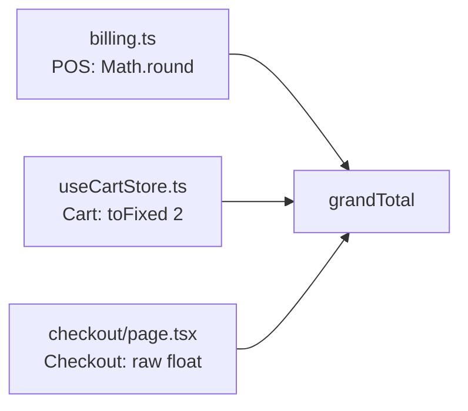

# 🔍 Pala Pitta Ruchulu — Comprehensive Codebase Audit Report

**Date:** August 21, 2026  
**Scope:** Errors · Performance · UI/UX · Customer ↔ Admin Flows · Data Representation

---

## Table of Contents

1. [Executive Summary](#executive-summary)
2. [Critical Bugs & Errors](#1-critical-bugs--errors)
3. [Performance Issues](#2-performance-issues)
4. [UI/UX Issues — Customer Website](#3-uiux-issues--customer-website)
5. [UI/UX Issues — Admin Panel](#4-uiux-issues--admin-panel)
6. [Customer ↔ Admin Connection Issues](#5-customer--admin-connection-issues)
7. [Flow Testing — Customer Flows](#6-flow-testing--customer-flows)
8. [Flow Testing — Admin Flows](#7-flow-testing--admin-flows)
9. [Data Representation Issues](#8-data-representation-issues)
10. [Architecture & Code Quality](#9-architecture--code-quality)
11. [Security Issues](#10-security-issues)
12. [Prioritized Remediation Plan](#11-prioritized-remediation-plan)

---

## Executive Summary

The codebase is a **Next.js 16 + Supabase + React 19** restaurant web app and POS system serving both customers and staff. The architecture is generally well-structured with good separation of concerns, thoughtful security decisions, and extensive inline documentation explaining past bug fixes. However, **42 issues** were identified across several categories.

| Category | 🔴 Critical | 🟠 High | 🟡 Medium | 🔵 Low |
|---|---|---|---|---|
| Bugs & Errors | 4 | 5 | 3 | 2 |
| Performance | 1 | 4 | 5 | 2 |
| UI/UX Customer | 0 | 2 | 4 | 3 |
| UI/UX Admin | 0 | 1 | 3 | 2 |
| Data Representation | 1 | 3 | 2 | 1 |
| **Total** | **6** | **15** | **17** | **10** |

---

## 1. Critical Bugs & Errors

### 🔴 BUG-01: Duplicate `Order.status` / `Order.orderStatus` Fields Cause Desynchronization

**Files:** [types/index.ts](file:///c:/01-PROJECTS/pala-pitta-ruchulu/src/types/index.ts#L149-L150), [queries/mappers.ts](file:///c:/01-PROJECTS/pala-pitta-ruchulu/src/lib/queries/mappers.ts#L75-L76)

The `Order` type has both `status` and `orderStatus` fields mapped to the same DB value. The mutation in [orders.ts](file:///c:/01-PROJECTS/pala-pitta-ruchulu/src/lib/queries/orders.ts#L72) patches both during optimistic updates, but **the `useCreateOrder` function** at line 143 sets `orderStatus: 'pending'` redundantly. Any code that reads `orderStatus` instead of `status` may see stale data if only one was updated.

```typescript
// types/index.ts — both exist on the same interface
status: OrderStatus;        // line 149
orderStatus?: OrderStatus;  // line 150 — WHY DOES THIS EXIST?
```

**Impact:** Order status could appear stale in some views, or transition callbacks could fire twice.

---

### 🔴 BUG-02: Checkout Calculates `grandTotal` Differently Than `billing.ts`

**Files:** [checkout/page.tsx](file:///c:/01-PROJECTS/pala-pitta-ruchulu/src/app/checkout/page.tsx#L144), [billing.ts](file:///c:/01-PROJECTS/pala-pitta-ruchulu/src/lib/billing.ts#L36-L71), [useCartStore.ts](file:///c:/01-PROJECTS/pala-pitta-ruchulu/src/store/useCartStore.ts#L221-L226)

Three separate grand total calculations exist:

| Location | Formula | Rounding |
|---|---|---|
| `billing.ts` (POS) | `Math.round(taxable + cgst + sgst + packaging)` | Whole rupees |
| `useCartStore.ts` (cart) | `parseFloat((taxable + cgst + sgst).toFixed(2))` | 2 decimal places |
| `checkout/page.tsx` | `subtotal + cgst + sgst - discountAmount` | None |

**Impact:** The checkout page, cart bar, and POS can show **different totals for the same order**. The POS rounds to whole rupees (correct for Indian billing), but the customer-facing cart shows paise. The bill printed vs. what the customer saw at checkout will differ by up to ₹0.99.

---

### 🔴 BUG-03: `InventoryItem` Has Duplicate Fields That Can Diverge

**File:** [types/index.ts](file:///c:/01-PROJECTS/pala-pitta-ruchulu/src/types/index.ts#L197-L211)

```typescript
quantity: number;            // line 200
currentStock: number;        // line 201 — mapped to the same DB value
unit: string;
minQuantity: number;         // line 203
minStockThreshold: number;   // line 204 — mapped to the same DB value
costPerUnit: number;         // line 208
unitCost: number;            // line 209 — mapped to the same DB value
```

The mapper in [mappers.ts](file:///c:/01-PROJECTS/pala-pitta-ruchulu/src/lib/queries/mappers.ts#L145-L164) assigns the same value to both aliases, but the `adjustInventoryQuantity` function in [AdminContext.tsx](file:///c:/01-PROJECTS/pala-pitta-ruchulu/src/context/AdminContext.tsx#L261-L285) patches both — evidence this has already caused visible bugs.

**Impact:** Inventory UI may show stale stock numbers until a full refetch.

---

### 🔴 BUG-04: Reorder Function Creates Fake Menu Items

**File:** [orders/page.tsx](file:///c:/01-PROJECTS/pala-pitta-ruchulu/src/app/orders/page.tsx#L215-L239)

The `handleReorder` function fabricates `MenuItem` objects from order history:

```typescript
addItem({
  id: orderItemId(item),
  category: 'starters',     // ← HARDCODED to 'starters' for ALL items
  rating: 4.8,              // ← FABRICATED
  reviewCount: 50,           // ← FABRICATED
  isPopular: true,           // ← FABRICATED
  isAvailable: true,         // ← ITEM MAY BE UNAVAILABLE NOW
  image: FALLBACK_DISH_IMAGE, // ← NOT THE REAL IMAGE
  prepTime: 20,             // ← HARDCODED
  tags: [],
});
```

**Impact:** Reordered items bypass availability checks — a customer can re-add a sold-out or discontinued dish. The cart reconciliation (`reconcileWithMenu`) will catch it only if the menu data has loaded, but the checkout page doesn't call it.

---

### 🟠 BUG-05: Cart Reconciliation Is Never Called on Checkout Page

**Files:** [CartMenuSync.tsx](file:///c:/01-PROJECTS/pala-pitta-ruchulu/src/components/customer/CartMenuSync.tsx), [checkout/page.tsx](file:///c:/01-PROJECTS/pala-pitta-ruchulu/src/app/checkout/page.tsx)

`CartMenuSync` runs in the providers, but the checkout page doesn't verify that items are still valid before submitting. A customer who opens `/checkout` with a stale localStorage cart that pre-dates a price change will order at the old price.

**Impact:** Price discrepancies between what was charged and what the kitchen expects.

---

### 🟠 BUG-06: Guest Order Tracking Can Miss Orders After Page Reload

**File:** [orders/page.tsx](file:///c:/01-PROJECTS/pala-pitta-ruchulu/src/app/orders/page.tsx#L65-L82)

The `guestOrderIds` are read from localStorage inside a `setTimeout(..., 0)`. This deferred read means:
1. On initial render, `guestOrderIds` is `[]`
2. `useGuestOrders([])` runs with `enabled: false` (ids.length === 0)
3. The timeout fires, sets the IDs
4. `useGuestOrders` re-runs

This race condition means the first render always shows "No orders yet" before snapping to the real list.

---

### 🟠 BUG-07: Razorpay Callback Return-Trip Can Lose Cart Data

**File:** [checkout/page.tsx](file:///c:/01-PROJECTS/pala-pitta-ruchulu/src/app/checkout/page.tsx#L239-L284)

The callback return-trip effect depends on `state.items.length > 0`, but:
1. The user pays via Razorpay → full page navigation to `/api/razorpay/callback`
2. The callback redirects back to `/checkout?payment=success`
3. Zustand's `persist` middleware must rehydrate the cart from `localStorage`
4. If rehydration hasn't completed, `state.items.length === 0` → effect doesn't run
5. Items eventually load → effect runs (maybe)

This is fragile and timing-dependent. A slow device or large cart could fail to trigger the finalization.

---

### 🟠 BUG-08: Orders Page Creates Duplicate Realtime Subscriptions

**File:** [orders/page.tsx](file:///c:/01-PROJECTS/pala-pitta-ruchulu/src/app/orders/page.tsx#L93-L146)

The `orders_page_realtime` channel in the orders page subscribes to the same `orders` table that `RealtimeProvider` already subscribes to (`rq_realtime_orders`). This means:
- **Every order UPDATE** fires two Supabase Realtime callbacks
- Both try to process the same event
- `RealtimeProvider` invalidates the query cache, AND the orders page's listener fires toasts

The `guestOrderIds` dependency on the effect causes channel teardown/rebuild whenever guest IDs change.

---

### 🟠 BUG-09: `useUpdateOrderPrepTime` Falls Back to Encoding Data in `notes` Column

**File:** [queries/orders.ts](file:///c:/01-PROJECTS/pala-pitta-ruchulu/src/lib/queries/orders.ts#L86-L114)

If the `delay_minutes` column doesn't exist (error code 42703), the mutation encodes the delay as `[DELAY:15]` in the `notes` string. This means:
- Any actual notes are overwritten
- The mapper in [mappers.ts](file:///c:/01-PROJECTS/pala-pitta-ruchulu/src/lib/queries/mappers.ts#L94-L101) parses this back with regex, but if the delay was updated twice, only the last `[DELAY:X]` survives

**Impact:** Kitchen notes can be lost when delay is set.

---

### 🟡 BUG-10: Admin Dashboard `dayKey()` Uses Browser Timezone, Not IST

**File:** [admin/page.tsx](file:///c:/01-PROJECTS/pala-pitta-ruchulu/src/app/admin/page.tsx#L12-L17)

```typescript
const dayKey = (d: Date) => {
  const y = d.getFullYear();
  const m = String(d.getMonth() + 1).padStart(2, '0');
  const day = String(d.getDate()).padStart(2, '0');
  return `${y}-${m}-${day}`;
};
```

This uses the browser's local timezone, but `mapOrder()` uses IST-pinned dates via `orderDateStamp()`. If an admin accesses the dashboard from outside India, "today's" revenue will be calculated against a different day boundary than what the order dates were stamped with.

---

### 🟡 BUG-11: `Customer.email` Fabrication in AdminContext

**File:** [AdminContext.tsx](file:///c:/01-PROJECTS/pala-pitta-ruchulu/src/context/AdminContext.tsx#L105-L132)

Guest customers get fabricated email addresses:

```typescript
email: (o.customerId && o.customerId.includes('@')) 
  ? o.customerId 
  : `${key.replace(/\D/g, '') || 'guest'}@palapitta.com`
```

**Impact:** These fabricated emails could be accidentally used for real communication (WhatsApp/email templates).

---

### 🟡 BUG-12: `handleReorder` Adds Individual Quantities but Doesn't Respect Original Quantities

**File:** [orders/page.tsx](file:///c:/01-PROJECTS/pala-pitta-ruchulu/src/app/orders/page.tsx#L218-L237)

The reorder iterates over `items` but calls `addItem()` once per item entry, regardless of `item.quantity`. It announces `addedCount += item.quantity || 1` items in the toast, but only 1 was actually added per loop iteration.

**Impact:** "3 items added to cart" toast when only 1 of each was added.

---

### 🔵 BUG-13: `TECH_STACK.md` Says React Strict Mode Is Disabled, But `next.config.ts` Has It Enabled

**Files:** [TECH_STACK.md](file:///c:/01-PROJECTS/pala-pitta-ruchulu/TECH_STACK.md#L61), [next.config.ts](file:///c:/01-PROJECTS/pala-pitta-ruchulu/next.config.ts#L78)

```typescript
// next.config.ts line 78:
reactStrictMode: true,  // ← ENABLED
```

```markdown
// TECH_STACK.md line 61:
- **React Strict Mode:** Disabled (prevents double-renders in dev)  // ← SAYS DISABLED
```

**Impact:** Documentation is wrong. Not a code bug, but can mislead developers.

---

### 🔵 BUG-14: `createOrderMutation` Doesn't Clear the Pending Razorpay Checkout Key

**File:** [checkout/page.tsx](file:///c:/01-PROJECTS/pala-pitta-ruchulu/src/app/checkout/page.tsx#L337-L345)

The `PENDING_CHECKOUT_KEY` is set before Razorpay opens, and cleared in the callback return-trip effect. But if the user pays successfully via the `handler` (non-redirect path), the key remains in `sessionStorage` until the next `?payment=` URL or manual clear.

**Impact:** Minor — the stale key could cause unexpected behavior on a subsequent checkout if `?payment=` somehow ends up in the URL.

---

## 2. Performance Issues

### 🔴 PERF-01: AdminContext Wraps Entire App, Loading All Admin Queries for Customers

**File:** [providers.tsx](file:///c:/01-PROJECTS/pala-pitta-ruchulu/src/app/providers.tsx#L57)

`AdminProvider` wraps the entire app tree, including customer pages. While it gates some queries behind `isStaff`, it still runs `useOrders()`, `useMenuItems()`, and `useCategories()` for **every customer session**.

```typescript
// AdminContext.tsx — these run for ALL users:
const { data: orders = [] } = useOrders();      // ALL orders, no user filter
const { data: menuItems = [] } = useMenuItems(); // acceptable
const { data: categories = [] } = useCategories(); // acceptable
```

**Impact:** Every customer session fetches ALL orders from the database. With 1,000+ orders, this is an unnecessary payload on every page load. The `useOrders()` query also has `refetchInterval: 3000` when active orders exist — polling every 3 seconds for a customer who has nothing to do with those orders.

---

### 🟠 PERF-02: Realtime Subscriptions Open for ALL Users Including Guests

**File:** [RealtimeProvider.tsx](file:///c:/01-PROJECTS/pala-pitta-ruchulu/src/components/providers/RealtimeProvider.tsx#L29-L106)

Six Supabase Realtime channels are opened for **every visitor** — including anonymous guests browsing the menu:
- `orders`, `reservations`, `menu_items`, `menu_categories`, `restaurant_tables`, `table_reservations`, `coupons`

A guest on the menu page has no use for live updates to `reservations`, `restaurant_tables`, or `coupons`.

**Impact:** Unnecessary WebSocket connections consume server resources and device battery.

---

### 🟠 PERF-03: Orders Page Has Double Realtime Subscription

**File:** [orders/page.tsx](file:///c:/01-PROJECTS/pala-pitta-ruchulu/src/app/orders/page.tsx#L93-L146)

As noted in BUG-08, this page opens its own realtime channel on the `orders` table, in addition to the global one from `RealtimeProvider`. Both fire on every change.

**Impact:** Double processing of every order event, double refetch cycles.

---

### 🟠 PERF-04: Three Google Fonts Loaded for Every Page

**File:** [layout.tsx](file:///c:/01-PROJECTS/pala-pitta-ruchulu/src/app/layout.tsx#L5-L32)

Three Google Fonts are loaded in the root layout:
- **Inter** (400–900 weights) — body text
- **Fraunces** (variable, with 3 axes: SOFT, WONK, opsz) — headings
- **Archivo** — admin-only

While there's a comment about `preload: false` for Archivo, the actual configuration doesn't set it. All three fonts are loaded on every page, including for customers who never see the admin.

**Impact:** ~100-200KB of font files loaded unnecessarily for customer sessions.

---

### 🟠 PERF-05: `globals.css` is 33KB — Single File Contains All Styles

**File:** [globals.css](file:///c:/01-PROJECTS/pala-pitta-ruchulu/src/app/globals.css) — 33,340 bytes

A single CSS file containing styles for the entire app (customer + admin + POS). Next.js doesn't code-split CSS from `globals.css` — all 33KB is sent to every visitor.

**Impact:** Customers download admin/POS styles they never use.

---

### 🟡 PERF-06: `useOrders()` Fetches ALL Orders Without Pagination

**File:** [queries/orders.ts](file:///c:/01-PROJECTS/pala-pitta-ruchulu/src/lib/queries/orders.ts#L13-L31)

```typescript
const { data, error } = await supabase
  .from('orders')
  .select('*')
  .order('created_at', { ascending: false });
```

No `limit()`, no pagination. As the restaurant operates, this table grows indefinitely. After 6 months of operation with ~50 orders/day, this is ~9,000 orders loaded into memory on every page load.

---

### 🟡 PERF-07: Customer Derivation Recomputes on Every Order Change

**File:** [AdminContext.tsx](file:///c:/01-PROJECTS/pala-pitta-ruchulu/src/context/AdminContext.tsx#L105-L132)

The entire customer list is derived from `orders` via `useMemo`. This O(n) computation runs on every order change, including realtime updates that happen every 3 seconds when active orders exist.

---

### 🟡 PERF-08: Menu Page Renders ALL Dishes Without Virtualization

**File:** [menu/page.tsx](file:///c:/01-PROJECTS/pala-pitta-ruchulu/src/app/menu/page.tsx#L585-L603)

Despite having `@tanstack/react-virtual` as a dependency, the menu page renders every dish as a real DOM node. With 200+ menu items, this creates hundreds of DOM elements.

---

### 🟡 PERF-09: `template.tsx` Remounts Entire Page Tree on Every Navigation

**File:** [template.tsx](file:///c:/01-PROJECTS/pala-pitta-ruchulu/src/app/template.tsx)

Using a `template.tsx` (instead of handling transitions in layout) forces a full remount of the page subtree on every navigation. The comment acknowledges this cost but says "nothing expensive should be added here" — however, the `key={pathname}` on the wrapper div forces React to unmount and remount the child page on every navigation.

---

### 🟡 PERF-10: Admin Dashboard Polls Date Every 60 Seconds via `setInterval`

**File:** [admin/page.tsx](file:///c:/01-PROJECTS/pala-pitta-ruchulu/src/app/admin/page.tsx#L53-L58)

```typescript
useEffect(() => {
  const tick = () => setNowTs(Date.now());
  tick();
  const t = setInterval(tick, 60_000);
  return () => clearInterval(t);
}, []);
```

This triggers a full `useMemo` recomputation of `stats`, `liveOrders`, `topSellers`, and `alerts` every 60 seconds — even when the dashboard is backgrounded (no `document.hidden` check).

---

### 🔵 PERF-11: `flyToCart.ts` is 6.5KB of Animation Code Loaded Everywhere

**File:** [flyToCart.ts](file:///c:/01-PROJECTS/pala-pitta-ruchulu/src/lib/flyToCart.ts) — 6,534 bytes

This fly-to-cart animation utility is likely imported by dish cards on the menu page, but the module may be pulled into other pages' bundles too since it's in `lib/`.

---

### 🔵 PERF-12: `thermalPrinter.ts` is 20KB Loaded on All Admin Pages

**File:** [thermalPrinter.ts](file:///c:/01-PROJECTS/pala-pitta-ruchulu/src/lib/thermalPrinter.ts) — 20,226 bytes

This is a large module for thermal receipt printing. If it's statically imported by any admin component in the layout, it's bundled for all admin pages.

---

## 3. UI/UX Issues — Customer Website

### 🟠 UX-C01: Home Page (`/`) Shows Spinner Instead of Content

**File:** [page.tsx](file:///c:/01-PROJECTS/pala-pitta-ruchulu/src/app/page.tsx)

The home page is a **pure router** — it shows a brand screen with a spinner, then redirects to `/menu` (customers) or `/admin` (staff). No customer ever sees actual content on `/`. This means:
- SEO gets no indexable content at the canonical URL
- First-time visitors see a loading state before being redirected
- The redirect adds ~200-500ms to the perceived load time

**Recommendation:** Make `/` the actual menu/home page, or use middleware for the role redirect.

---

### 🟠 UX-C02: No Error States for Failed Menu/Order Loading

While `isLoadingDB` skeleton states exist, there's no explicit error handling if `useMenuItems()` or `useOrders()` fails. A network error or Supabase outage shows an infinite loading skeleton.

---

### 🟡 UX-C03: Checkout Hardcodes "Madhapur" Location

**File:** [checkout/page.tsx](file:///c:/01-PROJECTS/pala-pitta-ruchulu/src/app/checkout/page.tsx#L190)

```typescript
customerAddress: 'Takeaway — Collect from Madhapur Restaurant',
```

And at line 507:

```typescript
'It's with the kitchen now. Ready for pickup at Madhapur in about 25 minutes.'
```

**Impact:** If the restaurant opens a second location, this is hardcoded in multiple places.

---

### 🟡 UX-C04: Checkout "25 Minutes" Pickup Estimate is Hardcoded

**File:** [checkout/page.tsx](file:///c:/01-PROJECTS/pala-pitta-ruchulu/src/app/checkout/page.tsx#L507)

The post-order confirmation says "about 25 minutes" regardless of order size or kitchen load. The order tracker on `/orders` does compute estimated times from menu item prep times, but the checkout confirmation ignores this.

---

### 🟡 UX-C05: Cart Persists Indefinitely via localStorage

**File:** [useCartStore.ts](file:///c:/01-PROJECTS/pala-pitta-ruchulu/src/store/useCartStore.ts#L196-L205)

The cart has no expiry. A customer who adds items and returns weeks later will see stale items. The `reconcileWithMenu` handles repricing and removal, but there's no TTL or "your cart is from 2 weeks ago" notice.

---

### 🟡 UX-C06: Missing Loading/Error States in `Suspense` Boundaries

**File:** [checkout/page.tsx](file:///c:/01-PROJECTS/pala-pitta-ruchulu/src/app/checkout/page.tsx#L757-L763)

```typescript
<Suspense fallback={null}>
  <CheckoutForm />
</Suspense>
```

The checkout page's `Suspense` fallback is `null` — a blank screen while `useSearchParams` resolves.

---

### 🔵 UX-C07: No "Back to Top" Button on Menu Page with 200+ Items

After scrolling through a long menu, there's no easy way back to the top besides the browser's scroll-to-top gesture.

---

### 🔵 UX-C08: Mobile Bottom Nav Hides on Certain Pages Without Clear Reason

**File:** [MobileBottomNav.tsx](file:///c:/01-PROJECTS/pala-pitta-ruchulu/src/components/customer/MobileBottomNav.tsx)

The bottom nav hides on checkout (via `HIDDEN_PREFIXES`). While intentional, the user loses their primary navigation on the page where they most need reassurance.

---

### 🔵 UX-C09: Order ID Format (`PPR-ORD-20260725-4821`) Is Too Long for Verbal Communication

When a customer calls to ask about an order or reads it out at the counter, a 20-character ID is unwieldy. The admin dashboard shows only the last 4 digits (`#4821`), but the customer-facing order confirmation shows the full ID.

---

## 4. UI/UX Issues — Admin Panel

### 🟠 UX-A01: All Staff Roles See Everything — RBAC is a No-Op

**File:** [roleAccess.ts](file:///c:/01-PROJECTS/pala-pitta-ruchulu/src/lib/roleAccess.ts#L22-L31)

```typescript
export const ROLE_ALLOWED_PREFIXES: Record<UserRole, string[] | 'all'> = {
  admin: 'all',
  manager: 'all',
  chef: 'all',      // ← Chef can access ALL admin pages
  cashier: 'all',   // ← Cashier can access ALL admin pages
  waiter: 'all',    // ← Waiter can access ALL admin pages
  customer: [],
};
```

Every staff role has `'all'` access. The `canAccess()` function at line 89 simply returns `true` for any non-customer. Despite having a rich role system (`admin`, `manager`, `chef`, `cashier`, `waiter`), there is **zero functional RBAC**. A waiter can modify the menu, manage employees, or view reports.

**Impact:** Security & operational risk. A waiter's compromised account has full admin access.

---

### 🟡 UX-A02: Dashboard Live Orders Table Is Capped at 8

**File:** [admin/page.tsx](file:///c:/01-PROJECTS/pala-pitta-ruchulu/src/app/admin/page.tsx#L100-L106)

```typescript
const liveOrders = useMemo(
  () => orders.filter(o => ['pending','preparing','ready'].includes(o.status)).slice(0, 8),
  [orders],
);
```

During peak hours with 20+ live orders, 12 are invisible on the dashboard. There's an "All orders" link, but the dashboard gives no indication that orders are hidden.

---

### 🟡 UX-A03: Notification Auto-Dismiss Is Only 2.5 Seconds

**File:** [AdminContext.tsx](file:///c:/01-PROJECTS/pala-pitta-ruchulu/src/context/AdminContext.tsx#L134-L139)

```typescript
const notify = (message: string, type: 'success' | 'error' | 'info' = 'success') => {
  useAdminStore.getState().showNotification(message, type);
  setTimeout(() => { useAdminStore.getState().clearNotification(); }, 2500);
};
```

2.5 seconds is barely enough to read a notification, especially for error messages that need attention.

---

### 🟡 UX-A04: Admin Theme CSS Is 18KB in a Separate File

**File:** [admin-theme.css](file:///c:/01-PROJECTS/pala-pitta-ruchulu/src/app/admin/admin-theme.css) — 18,446 bytes

The admin panel has its own 18KB CSS file on top of the 33KB globals.css. Combined, that's 51KB of CSS. While the admin CSS loads only for `/admin` routes, it's still quite large.

---

### 🔵 UX-A05: No Keyboard Shortcuts for Common Admin Actions

No keyboard shortcuts exist for frequent operations (accept order, mark as preparing, etc.). For a POS system used in a fast-paced kitchen environment, this is a significant usability gap.

---

### 🔵 UX-A06: `getRoleHome()` Always Returns `/admin` Regardless of Role

**File:** [roleAccess.ts](file:///c:/01-PROJECTS/pala-pitta-ruchulu/src/lib/roleAccess.ts#L94-L97)

Despite the `ROLE_HOME` map defining different landing pages per role (e.g., chef → `/admin/kitchen`, cashier → `/admin/pos`), the actual `getRoleHome()` function ignores it:

```typescript
export function getRoleHome(role: UserRole | null | undefined): string {
  if (!role || role === 'customer') return '/';
  return '/admin';  // ← Ignores ROLE_HOME map completely
}
```

---

## 5. Customer ↔ Admin Connection Issues

### 🟠 CONN-01: Customer Orders Page Shows ALL Orders (Not Just User's)

**File:** [orders/page.tsx](file:///c:/01-PROJECTS/pala-pitta-ruchulu/src/app/orders/page.tsx#L86-L87)

```typescript
const orders = user ? allOrders : guestOrders;
```

For logged-in users, `allOrders` comes from `useAdmin()` which calls `useOrders()` which fetches **ALL** orders from the database. The filtering to the user's own orders happens at line 173:

```typescript
const myOrders = useMemo(() => {
  return orders.filter((o) => user ? o.userId === user.id : guestOrderIds.includes(o.id));
}, [orders, user, guestOrderIds]);
```

This means a logged-in customer downloads every order ever placed, just to filter to their own. This is both a **performance** and **privacy** concern — although Supabase RLS should restrict the raw query, the frontend code doesn't rely on it.

---

### 🟠 CONN-02: WhatsApp/Push Notifications Are Fire-and-Forget with No Delivery Confirmation

**File:** [AdminContext.tsx](file:///c:/01-PROJECTS/pala-pitta-ruchulu/src/context/AdminContext.tsx#L180-L187)

```typescript
void postAuthedJson('/api/whatsapp/send-status-update', { orderId: id, newStatus: status });
void postAuthedJson('/api/push/notify-status-update', { orderId: id, newStatus: status });
```

These are fire-and-forget (`void`) — if WhatsApp or push fails, neither the admin nor the customer knows. There's no retry mechanism or failure tracking.

---

### 🟠 CONN-03: Customer Sees "Pay at Counter" but Admin Has No Matching Workflow

When a customer selects "Pay at counter" at checkout, the order is saved with `paymentStatus: 'unpaid'`. However, there's no explicit cashier workflow in the admin panel to reconcile these unpaid orders. The cashier would need to manually find the order and update its payment status.

---

### 🟡 CONN-04: Order Status Updates Don't Have Timestamps

The `updateOrderStatus` mutation only updates the `status` column. There's no `status_changed_at` or individual status timestamps (`preparing_at`, `ready_at`, `delivered_at`). This means:
- The order tracker can't show "preparing since 5 min ago"
- Reports can't calculate average preparation time
- The customer's "estimated time" is a guess, not based on when preparation actually started

---

### 🟡 CONN-05: Admin-Created POS Orders and Customer Web Orders Use Different ID Fields

POS orders use `id` in the items array, while web orders use `menuItemId`. The `PersistedOrderItem` type documents this mismatch but doesn't fix it:

```typescript
export interface PersistedOrderItem {
  menuItemId?: string;  // Storefront + webhooks
  id?: string;          // POS only — different name for the same thing
}
```

This means reports that try to group by dish ID need to check both fields.

---

## 6. Flow Testing — Customer Flows

### Flow: Browse Menu → Add to Cart → Checkout → Pay Online

| Step | Status | Issue |
|---|---|---|
| Visit `/` | ⚠️ | Shows spinner, redirects to `/menu` (200-500ms delay) |
| Menu loads | ✅ | Skeleton states shown, categories rail works |
| Search/filter | ✅ | URL-backed state, proper back/forward support |
| Add to cart | ✅ | Fly-to-cart animation, quantity stepper |
| View cart | ✅ | BillSummary with correct breakdown |
| Go to checkout | ✅ | Form with autofill from profile |
| Apply coupon | ✅ | Server-validated via API route |
| Pay online (Razorpay) | ⚠️ | Multiple fallback paths (handler/callback/ondismiss) add complexity |
| Payment success | ⚠️ | `redirect: true` causes full-page nav; relies on `sessionStorage` surviving |
| Order confirmation | ✅ | Shows order ID, amount, payment status |
| Track order | ✅ | Real-time updates via Supabase, toast notifications |

**Overall: 7/11 steps clean, 4 with concerns.**

### Flow: Browse Menu → Add to Cart → Checkout → Pay at Counter

| Step | Status | Issue |
|---|---|---|
| Select "Pay at counter" | ✅ | |
| Place order | ✅ | Order saved with `paymentStatus: 'unpaid'` |
| Order confirmation | ✅ | Shows "Pay at the counter when you collect" |
| Arrive at counter | ⚠️ | No ticket/token number for pickup identification |

### Flow: Guest Checkout (Not Logged In)

| Step | Status | Issue |
|---|---|---|
| Add items | ✅ | |
| Checkout without auth | ✅ | Name + phone required |
| Place order | ✅ | Guest order ID saved to `localStorage` |
| View orders | ⚠️ | Requires `localStorage` — incognito mode loses order history |
| Reorder | ⚠️ | Creates fake menu items (BUG-04) |

### Flow: Phone OTP Sign-In

| Step | Status | Issue |
|---|---|---|
| Enter phone | ✅ | Firebase OTP |
| Verify OTP | ✅ | Server verifies Firebase ID token |
| Complete profile | ⚠️ | Race condition between `verifyOtp` session and `SIGNED_IN` event |
| Redirect | ✅ | Lands on menu for customers |

---

## 7. Flow Testing — Admin Flows

### Flow: Accept and Process an Order

| Step | Status | Issue |
|---|---|---|
| New order notification | ✅ | Chime + toast via Realtime |
| View order details | ✅ | |
| Mark as Preparing | ✅ | Optimistic update, WhatsApp + Push sent |
| Add prep delay | ⚠️ | May overwrite notes (BUG-09) |
| Mark as Ready | ✅ | Customer notified |
| Mark as Delivered | ✅ | |

### Flow: POS Counter Order

| Step | Status | Issue |
|---|---|---|
| Open POS | ✅ | |
| Search/add items | ✅ | Portion selection works |
| Apply discount | ✅ | `computeBillTotals` handles both % and flat |
| Generate bill | ✅ | `billDocument.ts` / thermal printer |
| Hold order | ✅ | `HeldOrdersModal.tsx` |
| Save to database | ✅ | |

### Flow: Menu Management

| Step | Status | Issue |
|---|---|---|
| View menu items | ✅ | |
| Add new item | ✅ | Form validation via Zod schemas |
| Upload image | ✅ | Via `/api/upload` route |
| Toggle availability | ✅ | Instant via `toggleMenuItemAvailability` |
| Delete item | ⚠️ | No confirmation that existing cart items reference this dish |
| Category management | ✅ | CRUD with sort order |

---

## 8. Data Representation Issues

### 🔴 DATA-01: Three Different Grand Total Calculations

As detailed in BUG-02, the app has three different formulas for calculating the final price:



**Fix:** All price calculations should flow through `computeBillTotals()` from `billing.ts`.

---

### 🟠 DATA-02: Order Items Schema Is a Loose `any` Union

**File:** [types/index.ts](file:///c:/01-PROJECTS/pala-pitta-ruchulu/src/types/index.ts#L96-L127)

The `PersistedOrderItem` type honestly documents that three different producers (storefront, POS, webhooks) write incompatible shapes to the same `items` JSON column. Only `name`, `price`, and `quantity` are guaranteed present. This means:
- Reports can't reliably group by dish ID
- Veg/non-veg filtering on order items is inconsistent
- Portion information uses different field names (`selectedPortion` vs `portion`)

---

### 🟠 DATA-03: Customer Entity Is Derived from Orders, Not a Real Table

**File:** [AdminContext.tsx](file:///c:/01-PROJECTS/pala-pitta-ruchulu/src/context/AdminContext.tsx#L105-L132)

There is no `customers` table. The entire customer list is derived by iterating over orders and aggregating:
- Total spent, order count, loyalty points, VIP status
- Customer identity is keyed on `phone || customerId || customerName || 'GUEST'`

This means:
- A customer who changes their phone number appears as a new customer
- Guest orders from different devices create separate "customers"
- There's no way to store customer preferences, dietary restrictions, or communication preferences

---

### 🟠 DATA-04: Invoice/Bill Numbers Are Order IDs, Not Sequential

**File:** [types/index.ts](file:///c:/01-PROJECTS/pala-pitta-ruchulu/src/types/index.ts#L221-L222)

```typescript
export interface Bill {
  id: string;
  invoiceNo: string;  // This is just the order ID
  orderId: string;
```

Indian GST regulations require sequential invoice numbers. Using `PPR-ORD-20260725-4821` as an invoice number is not tax-compliant. There are gaps in the sequence (cancelled orders, failed payments), and the format isn't sequential.

---

### 🟡 DATA-05: Tax Rate (5% GST) Is Hardcoded in Multiple Places

| File | Value |
|---|---|
| `billing.ts` | `GST_RATE = 0.05` |
| `useCartStore.ts` | `taxable * 0.025` (CGST), `taxable * 0.025` (SGST) |

If the GST rate changes or the restaurant needs to apply different rates for different categories (e.g., beverages at 18%), this requires code changes in multiple files.

---

### 🟡 DATA-06: `createdAt` vs `orderDate` vs `orderTime` — Multiple Time Representations

**File:** [types/index.ts](file:///c:/01-PROJECTS/pala-pitta-ruchulu/src/types/index.ts#L153-L155)

```typescript
orderDate?: string;    // '2026-07-25' — IST date
orderTime?: string;    // '21:30' — IST time string
createdAt?: string;    // ISO timestamp — UTC
```

Orders have three different time representations. The mapper converts `createdAt` (UTC) to IST for `orderDate`, but some places use `createdAt` directly for sorting, which is in UTC.

---

### 🔵 DATA-07: Coupon System Has No Usage Tracking

The `Coupon` type has no `usageCount`, `maxUses`, or per-customer usage tracking. A customer can reuse the same coupon code indefinitely.

---

## 9. Architecture & Code Quality

### ARCH-01: Dual State Management (Context + Zustand + React Query)

The app uses three state management layers simultaneously:

| Layer | What It Manages |
|---|---|
| **Zustand** (3 stores) | Auth state, cart state, admin UI state |
| **React Context** (3 contexts) | Auth actions, admin data bridge, cart bridge |
| **React Query** (12 query hooks) | Server data (orders, menu, inventory, etc.) |

The Context layers are explicitly documented as "backward-compatible adapters" over Zustand/RQ, but they add an extra re-render boundary. `CartContext` re-renders all consumers on any cart change (documented in its own comment).

---

### ARCH-02: `server-only` Is Properly Used — Good Pattern

**Files:** [supabaseAdmin.ts](file:///c:/01-PROJECTS/pala-pitta-ruchulu/src/lib/supabaseAdmin.ts#L1), [db.ts](file:///c:/01-PROJECTS/pala-pitta-ruchulu/src/lib/db.ts#L1)

The `import 'server-only'` pattern correctly prevents service-role keys from leaking to the client. This is well done.

---

### ARCH-03: Comments Are Exceptional — Explain "Why", Not "What"

The codebase has some of the best inline comments I've seen. Nearly every significant decision is documented with the *reason*, the bug it fixed, and what the previous behavior was. Examples:

- Auth timeout explanation (line 191-201 of AuthContext.tsx)
- Why `landing after login` uses `window.location.replace` instead of `router.replace`
- Why `'unsafe-inline'` is needed in CSP

This is a major strength of the codebase.

---

## 10. Security Issues

### 🟠 SEC-01: Admin Email Whitelist Is Hardcoded in Client Code

**File:** [AuthContext.tsx](file:///c:/01-PROJECTS/pala-pitta-ruchulu/src/context/AuthContext.tsx#L27-L31)

```typescript
const ADMIN_EMAILS = [
  'vasistadronadula@gmail.com',
  'pathaniroshini@gmail.com',
  'palapittaruchulu@gmail.com',
];
```

These are in client-side code (anyone can see them in the browser bundle). While the comment explains this is a bootstrap mechanism backed by server-side RLS, exposing owner emails publicly is a phishing/social engineering vector.

---

### 🟠 SEC-02: `profiles.role` Is the Only Authorization Check — No Server-Side Route Guard

API routes like `/api/admin/employees` check the caller's role via the access token, but the authorization logic relies on the profile's `role` column, which is protected by RLS triggers. If a trigger is misconfigured, any user could potentially escalate.

The auth system correctly avoids trusting `user_metadata` (documented in the comment at line 106-112 of AuthContext.tsx), which shows good security awareness.

---

### 🟡 SEC-03: Webhook Routes Check Secret Presence but Not Timing-Safe Comparison

**Files:** The webhook secret environment variables (`SWIGGY_WEBHOOK_SECRET`, `ZOMATO_WEBHOOK_SECRET`) are checked, but the actual comparison should use a timing-safe equality check to prevent timing attacks.

---

### ✅ SEC-04: CSP Is Well-Configured (Good)

The Content-Security-Policy in [next.config.ts](file:///c:/01-PROJECTS/pala-pitta-ruchulu/next.config.ts#L47-L63) is thorough and properly scoped to the services the app actually uses. The report-only mode with an enforcement toggle is the right approach for a payment-processing site.

---

### ✅ SEC-05: Open Redirect Protection (Good)

The `safeRedirect()` function in [validation.ts](file:///c:/01-PROJECTS/pala-pitta-ruchulu/src/lib/validation.ts#L131-L138) correctly blocks protocol-relative URLs and backslash tricks. Well implemented.

---

## 11. Prioritized Remediation Plan

### 🔴 Must Fix — Before Next Deployment

| # | Issue | Effort | Impact |
|---|---|---|---|
| 1 | **BUG-02**: Unify grand total calculation → use `computeBillTotals()` everywhere | 2-3 hours | Billing accuracy |
| 2 | **BUG-04**: Reorder should look up real menu items, not fabricate them | 1-2 hours | Cart integrity |
| 3 | **DATA-01**: Same as BUG-02 | — | — |
| 4 | **PERF-01**: Gate `useOrders()` behind `isStaff` in AdminContext | 30 min | All customer sessions |
| 5 | **UX-A01**: Implement actual RBAC (or document that all staff = full access) | 1-4 hours | Security |
| 6 | **BUG-03**: Eliminate duplicate fields from `InventoryItem` type | 1-2 hours | Data consistency |

### 🟠 Should Fix — Next Sprint

| # | Issue | Effort |
|---|---|---|
| 7 | **PERF-02**: Gate realtime channels by auth state (guests need only `menu_items`) | 2 hours |
| 8 | **PERF-06**: Add pagination to `useOrders()` | 2-3 hours |
| 9 | **BUG-05**: Add cart reconciliation check at checkout submit time | 1 hour |
| 10 | **BUG-07**: Add explicit Zustand hydration wait in callback effect | 1 hour |
| 11 | **BUG-08**: Remove duplicate realtime subscription from orders page | 30 min |
| 12 | **CONN-01**: Filter orders server-side by user ID (RLS policy) | 1-2 hours |
| 13 | **DATA-02**: Normalize `PersistedOrderItem` — POS should write `menuItemId` | 2-3 hours |
| 14 | **DATA-04**: Implement sequential invoice numbers | 3-4 hours |
| 15 | **UX-A06**: Fix `getRoleHome()` to use `ROLE_HOME` map | 15 min |

### 🟡 Nice to Have — Backlog

| # | Issue | Effort |
|---|---|---|
| 16 | **UX-C01**: Make `/` the menu page, use middleware for staff redirect | 1-2 hours |
| 17 | **PERF-04**: Lazy-load Archivo font only for admin routes | 1 hour |
| 18 | **PERF-08**: Add list virtualization for menu items | 2-3 hours |
| 19 | **CONN-04**: Add status change timestamps to orders | 2-3 hours |
| 20 | **DATA-03**: Create a real `customers` table | Half-day |
| 21 | **DATA-05**: Centralize GST rate configuration | 1 hour |
| 22 | **BUG-09**: Add a dedicated `delay_minutes` column to the schema | 1 hour |
| 23 | **DATA-07**: Add coupon usage tracking | Half-day |

---

> [!IMPORTANT]
> **Highest-priority action item:** Unify the grand total calculation (BUG-02/DATA-01). Three different rounding strategies means customers, receipts, and reports will disagree about what was charged. This is the single most impactful fix.

> [!TIP]
> **Biggest quick win:** Fixing `getRoleHome()` to use the existing `ROLE_HOME` map (UX-A06) is a 15-minute change that immediately gives chefs and cashiers role-appropriate landing pages.

> [!NOTE]
> **Codebase strength:** The inline documentation quality is outstanding. Nearly every non-obvious decision has a comment explaining the reasoning, the bug it prevents, and what the previous behavior was. This makes the codebase significantly more maintainable than typical projects of this complexity.
